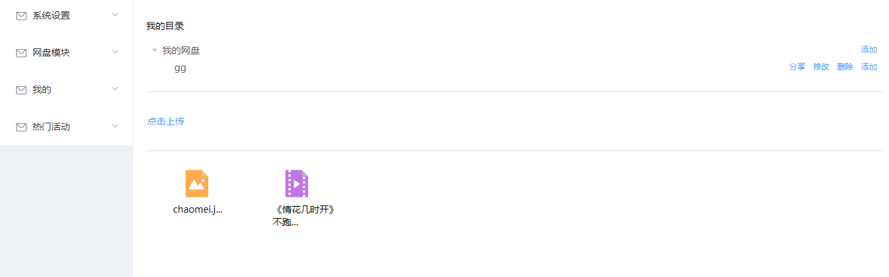
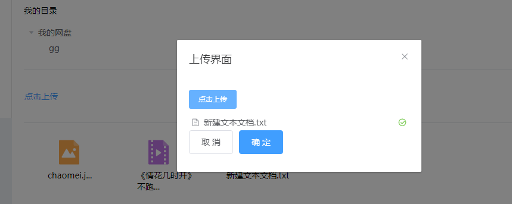
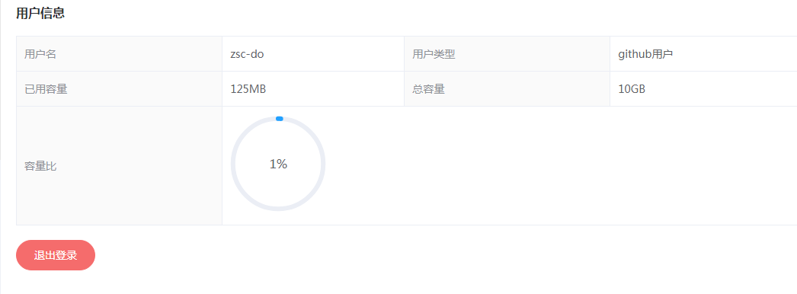
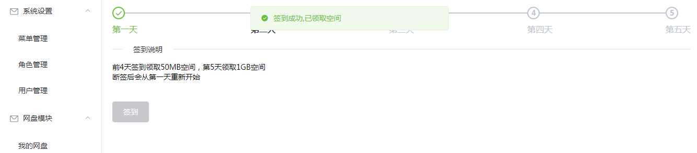

# light-disk-back
使用vue + .net + mysql + redis开发的前后端分离的网盘系统

前端项目链接：https://github.com/zsc-do/lightdisk-front

 功能：
1.用户登录与注册，实现 github 授权登录
2.用户文件的上传与下载，文件的管理
3.网盘文件的分享与保存
4.视频的在线播放
5.用户签到领空间活动,使用了redis的bitmap

截图：

